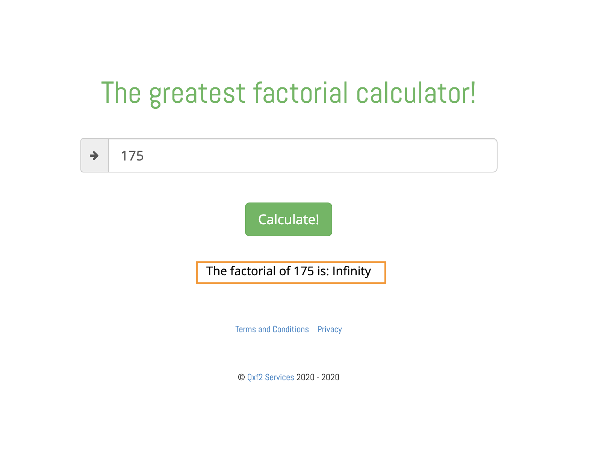

# Maximum Input Value
Factorial calculators are able to calculate the factorial of both positive and negative integers with most maxing out at the factorial of 170. Beyond 170, the factorial should be 'undefined'. 

## Steps to reproduce
1. Navigate to factorial calculator
2. Enter Positive Integer greater than 170 (eg: 175)

## Expected Result
For the input 175, the output should be 'undefined'. 

## Actual Result
The actual result is 'The factorial of 175 is: Infinity'.

